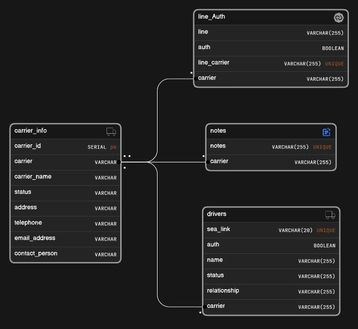
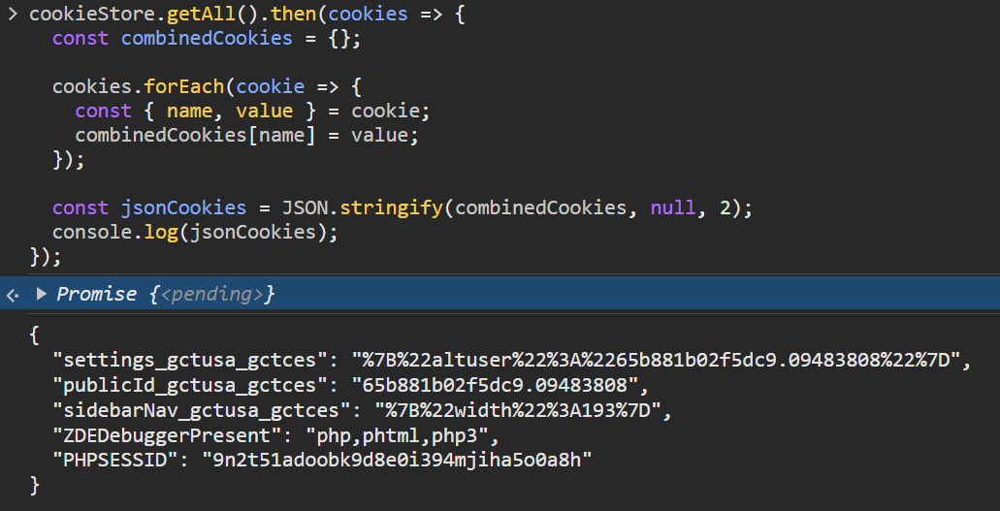

# Web Scraping and Data Extraction Readme

## Overview

This script is designed to scrape data from a specific website and store it in a PostgreSQL database. It uses the `requests` library to make HTTP requests, `BeautifulSoup` for web scraping, and `psycopg2` for connecting to and interacting with a PostgreSQL database. The extracted data is then processed using functions from the `data_extraction` module.

## Installation

1. Install the required Python libraries:

   ```bash
   pip3 install virtualenv
   virtualenv env
   source env/bin/activate
   sudo apt-get install --reinstall libpq-dev
   pip install requests
   pip install beautifulsoup4
   pip install psycopg2
   pip install argparse
   ```

### PostgreSQL Installation

1. Download the PostgreSQL installer for Windows from the official website: [PostgreSQL Downloads](https://www.postgresql.org/download/windows/)

2. Run the installer and follow the on-screen instructions to install PostgreSQL. During the installation, take note of the following:

   - PostgreSQL Database Superuser: **your_postgres_user**
   - PostgreSQL Database Password: **your_postgres_password**
   - PostgreSQL Port: **5432** (default)

3. Complete the installation process.

### Database Configuration

1. Open a command prompt and navigate to the PostgreSQL `bin` directory. This is typically located in the PostgreSQL installation directory. For example:

   ```bash
   cd C:\Program Files\PostgreSQL\your_postgres_version\bin
   ```

2. Initialize a new PostgreSQL database. Replace **your_database_name** with the desired name for your database:

   ```bash
   createdb -U your_postgres_user -O your_postgres_user -h localhost -p 5432 your_database_name
   ```

   Enter the PostgreSQL password when prompted.

### Update `DB_CONFIG` in the Script

1. Open the `script.py` file in a text editor.

2. Locate the `DB_CONFIG` dictionary and update it with the PostgreSQL configuration:

   ```python
   DB_CONFIG = {
      "dbname": "nyct_portl",
      "user": "nyct_user",
      "password": "Apple@123",
      "host": "localhost",
      "port": "5432",
   }
   ```

## DB Schema



## Steps for Authentication

1. **Open Developer Console:**
   - After logging in, navigate to the website.
   - Open the browser's developer console using `Ctrl+Shift+I`.

2. **Run the Following Command:**
   - Once the console is open, paste and run the following JavaScript command:

   ```javascript
   cookieStore.getAll().then(cookies => {
      const combinedCookies = {};

      cookies.forEach(cookie => {
         const { name, value } = cookie;
         combinedCookies[name] = value;
      });

      const jsonCookies = JSON.stringify(combinedCookies, null, 2);
      console.log(jsonCookies);
   });
   ```

3. **Copy JSON Output:**
   - After running the command, the console will display a JSON representation of the cookies.

4. **Save to `cookie.json` File:**
   - Copy the entire JSON output.
   - Create or open the `cookie.json` file.
   - Paste the copied JSON into the `cookie.json` file and save it.

   Example :
   

## Usage

1. Clone the repository:

   ```bash
   git clone https://github.com/devnouiq/nyct-portal-extractor.git
   ```

2. Navigate to the project directory:

   ```bash
   cd nyct-portal-extractor
   ```

3. Run the script with the following command:

   1. **Update Specific Carrier:**
      - To update data for a specific carrier, use the following command:
      ```bash
      python script.py --name "carrier-name" --operation_type update
      ```

   2. **Normal Operation:**
      - To run normally for a carrier or all carriers, use the following commands:
      - For a specific carrier:
         ```bash
         python script.py --name "carrier-name" --operation_type new
         ```
      - For all carriers (default 20 requests):
         ```bash
         python script.py --operation_type new
         ```
      - With a custom sleep interval (default 10 seconds):
         ```bash
         python script.py --sleep "time-in-seconds" --operation_type new
         ```
      - With a custom number of sets (each set represents 20 requests, default is 1 set):
         ```bash
         python script.py --count "number-value" --operation_type new
         ```

         For example, if you specify `--count 4`, it will run for 4 sets of 20 requests each, resulting in a total of 80 requests.

   Adjust the command-line arguments based on your specific needs. The script will now consider the specified arguments for carrier name, request count, sleep interval, and operation type.

## Data Extraction

The main data extraction function is `retrieve_all_data()`. Customize this function in the `data_extraction` module according to the structure of the data you are scraping from the website.

```python
retrieve_all_data(soup, conn, cursor)
```

## Logging

Logging is configured to display information messages. You can modify the logging level in the script based on your preferences.

   ```python
   logging.basicConfig(level=logging.INFO)
   ```
