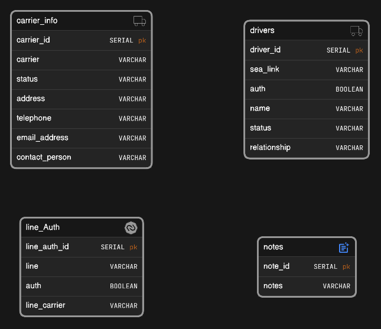

# Web Scraping and Data Extraction Readme

## Overview

This script is designed to scrape data from a specific website and store it in a PostgreSQL database. It uses the `requests` library to make HTTP requests, `BeautifulSoup` for web scraping, and `psycopg2` for connecting to and interacting with a PostgreSQL database. The extracted data is then processed using functions from the `data_extraction` module.

## Installation

1. Install the required Python libraries:

   ```bash
   pip install requests
   pip install beautifulsoup4
   pip install psycopg2
   pip install argparse
   ```

2. Ensure that you have a PostgreSQL database set up.

## Usage

1. Clone the repository:

   ```bash
   git clone https://github.com/your-username/nyct-portal-extractor.git
   ```

2. Navigate to the project directory:

   ```bash
   cd nyct-portal-extractor
   ```

3. Run the script with the following command:

   ```bash
   python script.py [--name NAME]
   ```

   or 

   ```bash
   python script.py
   ```

  ### Note:
  The optional `--name` argument allows you to specify a carrier name for which you want to extract data. If not provided, the script will run for all carriers.


   Adjust the following parameters in the script according to your requirements:

   ```python
   num_requests = 1  # Set the number of requests to be sent
   ```

   This script is designed to handle pagination automatically. It sends requests to the specified URL template with different start values to retrieve sets of data.

   ```python
   url_template = "https://nyctportal.global-terminal.com/gctusa/gctces/index.php?pageId=37&q=*&start={}&count=20"
   ```

   Modify the `headers` dictionary as needed for your specific web scraping requirements.

## Database Connection

Ensure the `DB_CONFIG` dictionary in the script matches your PostgreSQL database configuration:

```python
DB_CONFIG = {
    "dbname": "your_database_name",
    "user": "your_database_user",
    "password": "your_database_password",
    "host": "your_database_host",
    "port": "your_database_port",
}
```



## Data Extraction

The main data extraction function is `retrieve_all_data()`. Customize this function in the `data_extraction` module according to the structure of the data you are scraping from the website.

```python
retrieve_all_data(soup, conn, cursor)
```

## Update Operations

To update the data in the database, checkout the `update_operations` script. You can change and update specific data using the ID of specific tables. Customize the update operations according to your needs.

To run this script:

```bash
python update_operations.py
```

## Additional Steps for Authentication

After logging in or using guest login on the website, open the console using `ctrl+shift+i` and run the following command:

```javascript
cookieStore.getAll().then(cookies => {
  const combinedCookies = {};

  cookies.forEach(cookie => {
    const { name, value } = cookie;
    combinedCookies[name] = value;
  });

  console.log(combinedCookies);
});
```

Copy the values obtained and paste them in the `script.py` - `get_cookies()`:

```python
  "PHPSESSID": "",
  "ZDEDebuggerPresent": "",
  "publicId_gctusa_gctces": "",
  "settings_gctusa_gctces": "",
  "sidebarNav_gctusa_gctces": "",
```

## Logging

Logging is configured to display information messages. You can modify the logging level in the script based on your preferences.

```python
logging.basicConfig(level=logging.INFO)
```